# **Đề tài: Triển khai Hệ thống Giám sát và Cảnh báo Thông tin Tập trung với Grafana, Prometheus, Zabbix và Wazuh SIEM**

---

## MỤC LỤC

- [CHƯƠNG 1: MỞ ĐẦU](#chương-1-mở-đầu)
  - [1.1 Lý do chọn đề tài](#11-lý-do-chọn-đề-tài)
  - [1.2 Mục tiêu nghiên cứu](#12-mục-tiêu-nghiên-cứu)
- [CHƯƠNG 2: CƠ SỞ LÝ THUYẾT VÀ KIẾN TRÚC HỆ THỐNG](#chương-2-cơ-sở-lý-thuyết-và-kiến-trúc-hệ-thống)
  - [2.1 Tổng quan về các nền tảng lõi](#21-tổng-quan-về-các-nền-tảng-lõi)
  - [2.2 Phân tách luồng dữ liệu: Metrics và Security Logs](#22-phân-tách-luồng-dữ-liệu-metrics-và-security-logs)
  - [2.3 So sánh Prometheus AlertManager và Grafana Alerting](#23-so-sánh-prometheus-alertmanager-và-grafana-alerting)
  - [2.4 Sơ đồ Kiến trúc và Phân tích Luồng Dữ liệu (Data Flow)](#24-sơ-đồ-kiến-trúc-và-phân-tích-luồng-dữ-liệu-data-flow)
- [CHƯƠNG 3: QUY TRÌNH TRIỂN KHAI THỰC TẾ](#chương-3-quy-trình-triển-khai-thực-tế)
  - [3.1 Triển khai Nền tảng Giám sát Cơ sở (Prometheus, Grafana & Node Exporter)](#31-triển-khai-nền-tảng-giám-sát-cơ-sở-prometheus-grafana--node-exporter)
  - [3.2 Tích hợp và Cấu hình Mạng Wazuh Indexer](#32-tích-hợp-và-cấu-hình-mạng-wazuh-indexer)
  - [3.3 Cài đặt Cảm biến An ninh (Wazuh Agent)](#33-cài-đặt-cảm-biến-an-ninh-wazuh-agent)
  - [3.4 Cấu hình Nguồn Dữ liệu (Data Source) trên Grafana](#34-cấu-hình-nguồn-dữ-liệu-data-source-trên-grafana)
  - [3.5 Xây dựng Bảng điều khiển (Dashboards)](#35-xây-dựng-bảng-điều-khiển-dashboards)
  - [3.6 Thiết lập Cơ chế Cảnh báo (Alerting) trên hệ sinh thái Wazuh](#36-thiết-lập-cơ-chế-cảnh-báo-alerting-trên-hệ-sinh-thái-wazuh)
  - [3.7 Triển khai Zabbix và Giám sát Thiết bị Mạng (EVE-NG Lab)](#37-triển-khai-zabbix-và-giám-sát-thiết-bị-mạng-eve-ng-lab)
- [CHƯƠNG 4: TÍCH HỢP ĐIỀU TRA SỰ CỐ](#chương-4-tích-hợp-điều-tra-sự-cố)
  - [4.1 Cơ chế trích xuất dữ liệu tự động (Data Extraction)](#41-cơ-chế-trích-xuất-dữ-liệu-tự-động-data-extraction)
  - [4.2 Kỹ thuật nhúng mã và Định tuyến (URL Embedding & Routing)](#42-kỹ-thuật-nhúng-mã-và-định-tuyến-url-embedding--routing)
  - [4.3 Quy trình phản ứng sự cố thực tế (Automated Incident Response Flow)](#43-quy-trình-phản-ứng-sự-cố-thực-tế-automated-incident-response-flow)
- [CHƯƠNG 5: KẾT LUẬN VÀ HƯỚNG PHÁT TRIỂN](#chương-5-kết-luận-và-hướng-phát-triển)
  - [5.1 Kết quả đạt được](#51-kết-quả-đạt-được)
  - [5.2 Hướng phát triển mở rộng: Định hình Kiến trúc AIOps](#52-hướng-phát-triển-mở-rộng-định-hình-kiến-trúc-aiops)
- [TÀI LIỆU THAM KHẢO](#tài-liệu-tham-khảo)

---

## CHƯƠNG 1: MỞ ĐẦU

### 1.1 Lý do chọn đề tài
Trong vận hành hệ thống Enterprise truyền thống, người quản trị thường đối mặt với rủi ro "bội thực công cụ" (Tool Fatigue). Khi sự cố xảy ra, họ phải truy cập hàng loạt các bảng điều khiển tách biệt: xem số liệu phần cứng (CPU, RAM) trên Prometheus, kiểm tra log an ninh trên Wazuh/Elasticsearch, hay xem lưu lượng mạng trên Zabbix. Sự phân mảnh này dẫn đến việc xử lý sự cố chậm trễ.
Bên cạnh đó, các công cụ cảnh báo truyền thống thường hoạt động thụ động, thiếu ngữ cảnh và dễ gây ra tình trạng "Spam cảnh báo" khiến người quản trị bỏ lỡ các sự cố nghiêm trọng thực sự.
Do đó, đồ án này đề xuất và triển khai một mô hình hệ thống giám sát thế hệ mới: **Mô hình Trung tâm Điều hành Hợp nhất** kết hợp quy trình tối ưu hóa cảnh báo qua Telegram.

### 1.2 Mục tiêu nghiên cứu
- Phân tách và kết hợp hoàn hảo hai luồng dữ liệu độc lập: **Metrics** (số liệu phần cứng) và **Logs** (sự kiện bảo mật).
- Triển khai **Grafana** làm trung tâm hội tụ đa nguồn (Multi-Datasource).
- Triển khai và tích hợp hệ thống **Wazuh** để phát hiện mã độc và tấn công.
- Thiết lập kênh phản ứng nhanh thông qua **Telegram Bot**.
- Đặt nền móng cho kiến trúc tự động hóa vận hành kết hợp trí tuệ nhân tạo (AIOps).

---

## CHƯƠNG 2: CƠ SỞ LÝ THUYẾT VÀ KIẾN TRÚC HỆ THỐNG

### 2.1 Tổng quan về các nền tảng lõi
Để xây dựng một hệ thống giám sát toàn diện, đồ án kết hợp sức mạnh của 6 thành phần mã nguồn mở cốt lõi trong lĩnh vực quản trị hệ thống:
- **Prometheus:** Nền tảng giám sát hệ thống dựa trên cơ sở dữ liệu chuỗi thời gian (Time-Series Database - TSDB). Khác với các cơ sở dữ liệu quan hệ truyền thống, Prometheus được thiết kế chuyên biệt để ghi nhận khối lượng lớn các điểm dữ liệu đo lường (metrics) ở tốc độ cao, thông qua cơ chế chủ động truy vấn (Pull Mechanism).
- **Node Exporter:** Đóng vai trò là tác tử (Agent) đo lường phần cứng. Chức năng chính của Node Exporter là trích xuất các thông số từ lõi hệ điều hành (CPU, RAM, Disk, Network), sau đó "phiên dịch" (export) chúng sang định dạng tiêu chuẩn (Prometheus exposition format) và phơi bày qua giao thức HTTP để máy chủ Prometheus thu thập.
- **Wazuh SIEM:** Hệ thống quản lý thông tin và sự kiện an toàn bảo mật. Wazuh hoạt động theo mô hình Client-Server, thu thập nhật ký hệ thống (Logs) từ Agent, đối soát liên tục với bộ quy tắc (Ruleset) chuẩn MITRE ATT&CK nhằm phát hiện và định danh các hành vi tấn công mạng.
- **OpenSearch (Wazuh Indexer):** Công cụ phân tích và tìm kiếm dữ liệu phân tán (được phát triển từ Elasticsearch). Trong đồ án này, OpenSearch đóng vai trò là cơ sở dữ liệu cốt lõi của Wazuh, chuyên xử lý và đánh chỉ mục (Indexing) các cảnh báo an ninh, hỗ trợ truy vấn tìm kiếm toàn văn bản (Full-text search) với hiệu năng cao.
- **Zabbix & SNMP Monitoring:** Nền tảng giám sát hạ tầng mạng chuyên dụng theo cơ chế không cần tác tử (Agentless SNMP). Zabbix đóng vai trò thu thập thông số lưu lượng băng thông (Interface Traffic), trạng thái kết nối (Link Down/Up), CPU/RAM từ các thiết bị mạng cốt lõi (Firewall pfSense, Core Switch Cisco) trong môi trường Lab EVE-NG.
- **Grafana:** Nền tảng trực quan hóa dữ liệu, đóng vai trò "Màn hình điều khiển hợp nhất". Grafana không trực tiếp lưu trữ dữ liệu; thay vào đó, hệ thống thực hiện các truy vấn đồng thời tới nhiều nguồn dữ liệu (Prometheus, OpenSearch, Zabbix) nhằm tổng hợp biểu đồ và thiết lập cơ sở kích hoạt cảnh báo.


### 2.2 Phân tách luồng dữ liệu: Metrics và Security Logs
Một kiến trúc giám sát tiêu chuẩn Enterprise yêu cầu sự tách biệt rõ ràng giữa hai luồng dữ liệu đặc thù:

| Tiêu chí | Luồng Metrics (Prometheus) | Luồng Logs & Events (Wazuh / OpenSearch) |
| :--- | :--- | :--- |
| **Bản chất** | Dữ liệu định lượng (Numbers) biến thiên theo thời gian. | Chuỗi văn bản chi tiết (Text & Strings) lưu vết sự kiện. |
| **Ví dụ** | `RAM = 80%`, `CPU = 90%` | `"Invalid user hieunn from 192.168.68.181 port 36958"` |
| **Lưu trữ** | Prometheus TSDB (Cấu trúc block tối ưu nén dữ liệu). | Wazuh Indexer (Tối ưu đánh chỉ mục và tìm kiếm văn bản). |

> [!IMPORTANT]
> **Điểm nhấn lý thuyết:** Cơ sở dữ liệu của Prometheus được thiết kế chuyên biệt cho kiểu dữ liệu số (Float/Integer). Việc lưu trữ dữ liệu an toàn thông tin (chứa IP, Username, chuỗi lệnh) bắt buộc phải được đảm nhiệm bởi một kho dữ liệu tài liệu (Document-oriented Database) như **Wazuh Indexer**, nhằm bảo toàn nguyên vẹn ngữ cảnh của sự kiện.

### 2.3 So sánh Prometheus AlertManager và Grafana Alerting
Mặc dù hệ sinh thái Prometheus cung cấp sẵn AlertManager, đồ án lựa chọn **Grafana Alerting** làm cơ chế báo động trung tâm dựa trên các ưu điểm sau:
1. **Khả năng Đa nguồn (Multi-Datasource):** AlertManager bị giới hạn trong phạm vi dữ liệu của Prometheus. Ngược lại, Grafana hỗ trợ truy xuất và tổng hợp cảnh báo từ đa dạng nguồn dữ liệu, bao gồm cả nhật ký an ninh từ Wazuh.
2. **Khuôn mẫu tin nhắn (Message Templates):** Grafana cung cấp công cụ tùy biến nội dung thông báo thông qua ngôn ngữ đánh dấu HTML/Go Template, tối ưu hóa giao diện hiển thị trên Telegram.
3. **Phép toán kết hợp:** Cho phép kết hợp và tính toán biểu thức (Expressions) từ nhiều nguồn dữ liệu khác nhau trước khi ra quyết định kích hoạt cảnh báo.

### 2.4 Sơ đồ Kiến trúc và Phân tích Luồng Dữ liệu (Data Flow)

Kiến trúc hệ thống được phân chia thành 4 khối chức năng, hoạt động theo luồng dữ liệu như sau:

1. **Khối Client (Máy chủ mục tiêu):** Nơi triển khai các tác tử thu thập dữ liệu bao gồm Node Exporter (giám sát tài nguyên phần cứng) và Wazuh Agent (giám sát an toàn thông tin).
2. **Khối Wazuh SIEM (Xử lý Log):** 
   - *Wazuh Agent* phát hiện các sự kiện hệ thống và đẩy (Push) dữ liệu thô về *Wazuh Manager*.
   - *Wazuh Manager* đóng vai trò xử lý trung tâm, giải mã log, đối chiếu quy tắc bảo mật và gán nhãn Rule ID cùng mức độ rủi ro (Level).
   - Dữ liệu sự kiện sau đó được dịch vụ Filebeat chuyển tiếp tới *Wazuh Indexer (OpenSearch)* để lưu trữ và đánh chỉ mục.
3. **Khối Master (Giám sát trung tâm):**
   - *Prometheus* duy trì chu kỳ định kỳ (Pull) để truy xuất dữ liệu phần cứng từ các Node Exporter.
   - *Grafana* hoạt động như giao diện trung tâm, sử dụng PromQL để truy vấn dữ liệu từ Prometheus và giao thức REST API (cổng 9200) để truy vấn nhật ký an ninh từ Wazuh Indexer.
4. **Khối Cảnh báo (Alerting):** Grafana đánh giá các biểu thức giám sát; khi dữ liệu vượt ngưỡng (Threshold), hệ thống sẽ gửi yêu cầu POST (HTTPS) tới Telegram Bot API để phát đi thông báo.

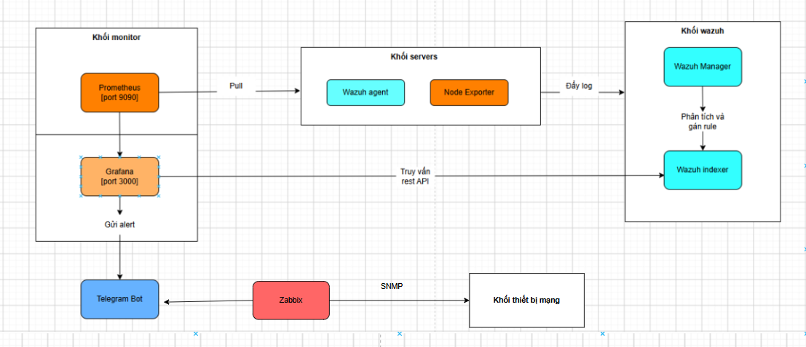

---

## CHƯƠNG 3: QUY TRÌNH TRIỂN KHAI THỰC TẾ

### 3.1 Triển khai Nền tảng Giám sát Cơ sở (Prometheus, Grafana & Node Exporter)
Để đảm bảo tính linh hoạt và dễ dàng cô lập môi trường, hệ thống giám sát trung tâm được triển khai hoàn toàn trên nền tảng Container (Docker). Dưới đây là các bước cấu hình chi tiết để khởi chạy:

**Bước 1: Cấu hình hệ thống Prometheus và Grafana trên máy chủ Master**
1. Tạo thư mục chứa dữ liệu và tệp cấu hình:
   ```bash
   sudo mkdir -p /opt/monitoring
   cd /opt/monitoring
   ```
2. Khởi tạo tệp cấu hình `prometheus.yml` để định tuyến mục tiêu thu thập dữ liệu:
   ```yaml
   global:
     scrape_interval: 15s
   scrape_configs:
     - job_name: 'prometheus'
       static_configs:
         - targets: ['localhost:9090']
   ```
3. Tạo tệp `docker-compose.yml` định nghĩa cụm vi dịch vụ:
   ```yaml
   version: '3.8'
   services:
     prometheus:
       image: prom/prometheus:latest
       ports:
         - "9090:9090"
       volumes:
         - ./prometheus.yml:/etc/prometheus/prometheus.yml
       restart: unless-stopped

     grafana:
       image: grafana/grafana:latest
       ports:
         - "3000:3000"
       restart: unless-stopped
   ```
4. Kích hoạt và chạy ngầm cụm dịch vụ:
   ```bash
   sudo docker compose up -d
   ```


**Bước 2: Cài đặt công cụ đo lường Node Exporter trên máy con (Clients)**
Để công cụ tự động khởi động cùng hệ điều hành, Node Exporter được cấu hình chuẩn theo dạng Systemd Service. Quản trị viên chỉ cần sao chép và chạy toàn bộ khối lệnh sau:
```bash
# Tải và giải nén phần mềm
cd /tmp
wget https://github.com/prometheus/node_exporter/releases/download/v1.8.2/node_exporter-1.8.2.linux-amd64.tar.gz
tar -xvf node_exporter-1.8.2.linux-amd64.tar.gz
sudo mv node_exporter-1.8.2.linux-amd64/node_exporter /usr/local/bin/

# Tạo tài khoản hệ thống cô lập để tăng tính bảo mật
sudo useradd -rs /bin/false node_exporter

# Tạo file cấu hình dịch vụ Systemd tự khởi động
sudo bash -c 'cat <<EOF > /etc/systemd/system/node_exporter.service
[Unit]
Description=Node Exporter
After=network.target

[Service]
User=node_exporter
Group=node_exporter
Type=simple
ExecStart=/usr/local/bin/node_exporter

[Install]
WantedBy=multi-user.target
EOF'

# Kích hoạt và chạy dịch vụ
sudo systemctl daemon-reload
sudo systemctl enable node_exporter
sudo systemctl start node_exporter
```

**Bước 3: Xác thực luồng dữ liệu Metrics trên Prometheus**
Sau khi hoàn tất tiến trình cài đặt Node Exporter, quản trị viên truy cập vào giao diện web của Prometheus để kiểm tra trạng thái hệ thống mục tiêu (Targets) nhằm đảm bảo dữ liệu phần cứng (Metrics) đang được thu thập ổn định:

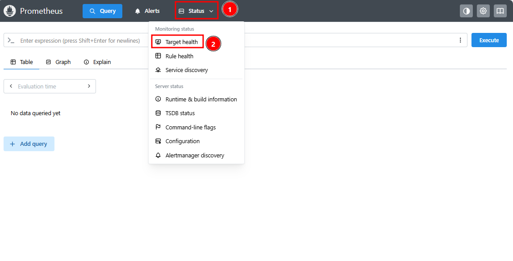

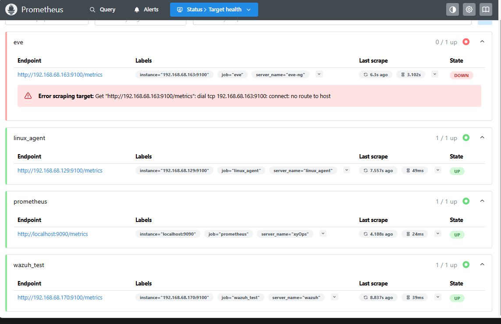

**Bước 4: Thiết lập Cơ chế Cảnh báo Đo lường (Grafana Alerting)**
Hệ thống giám sát được tích hợp khả năng phản ứng tức thời thông qua việc định tuyến cảnh báo từ Grafana về Telegram:

*1. Khai báo kênh tiếp nhận (Contact Points)*
Quá trình kết nối tới Telegram yêu cầu xác thực thông qua hai tham số bảo mật: `BOT API Token` và `Chat ID`.

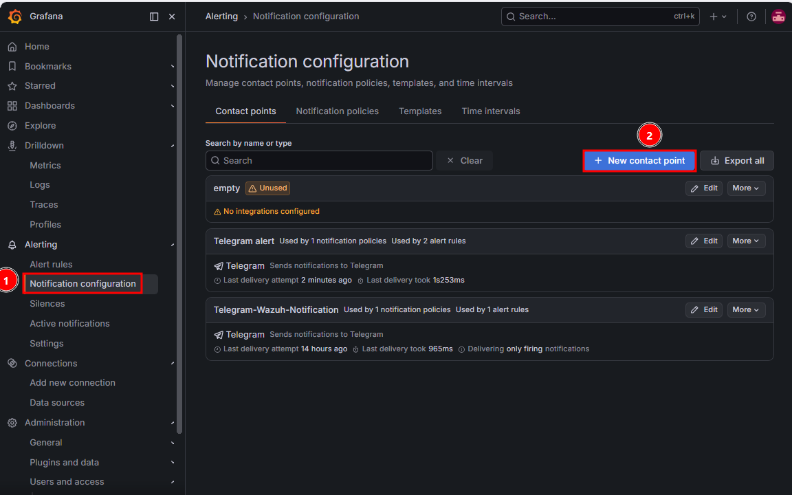

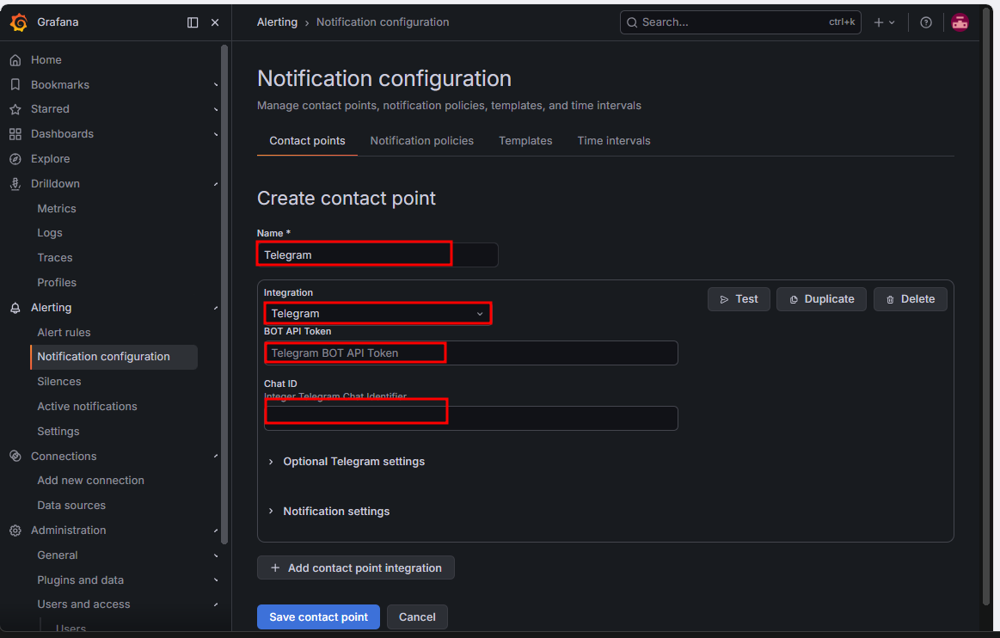

*2. Khai báo Luật cảnh báo (Alert Rules)*
Luật cảnh báo được cấu trúc dựa trên PromQL nhằm đánh giá liên tục các chỉ số tài nguyên (ví dụ: cảnh báo khi CPU hoặc RAM bị quá tải).

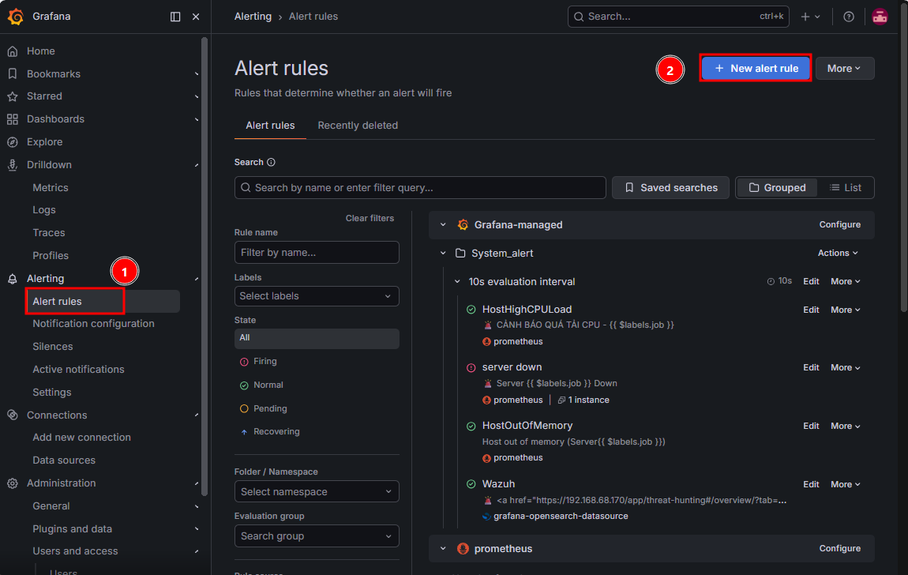

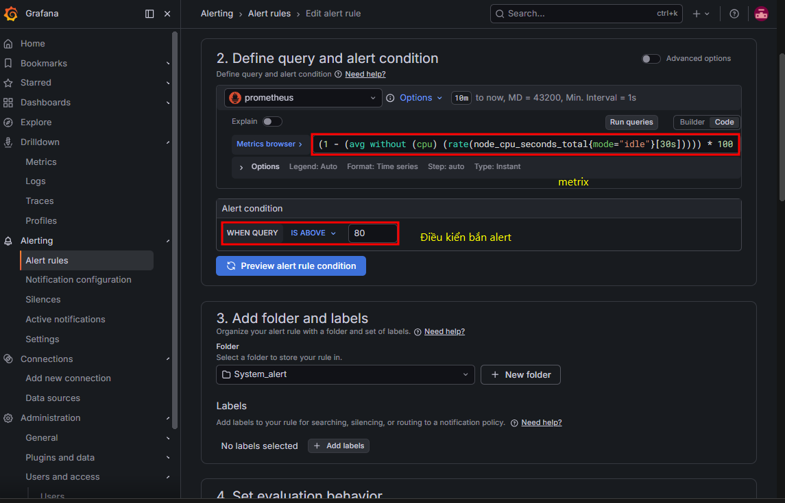

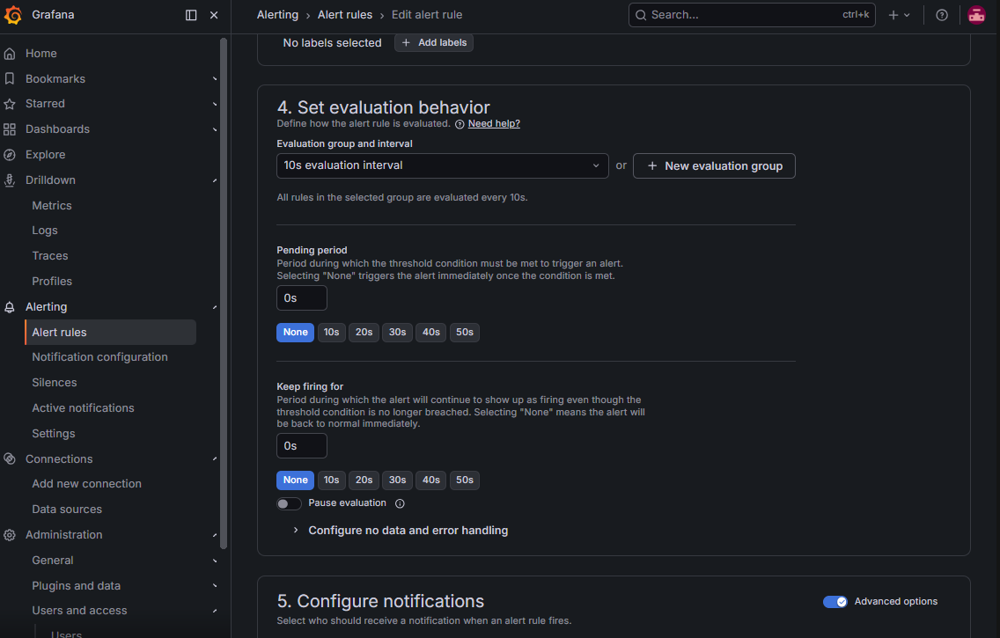

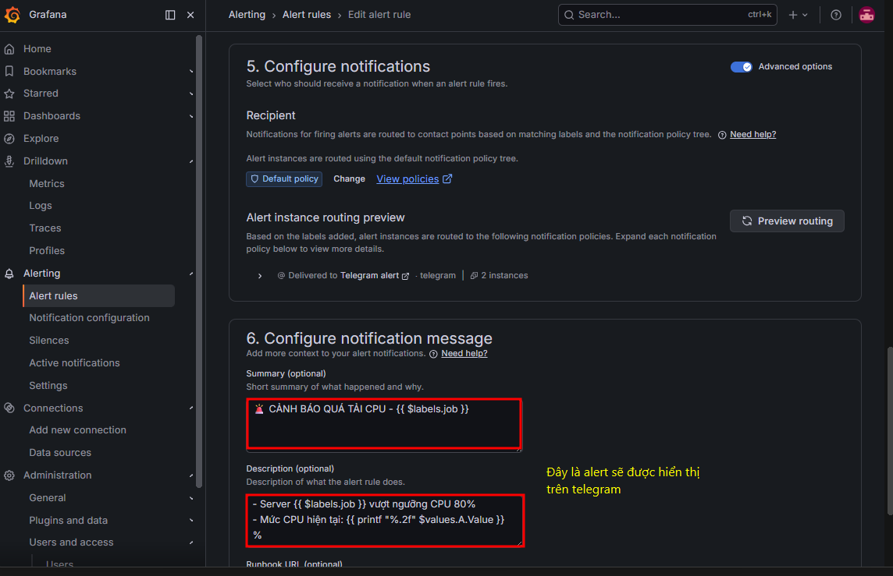

*3. Xác thực kết quả tích hợp*
Sau khi luồng cấu hình hoàn tất, hệ thống sẽ tự động phân tích và đẩy tín hiệu báo động về ứng dụng Telegram của người quản trị mỗi khi phát sinh vi phạm tài nguyên.

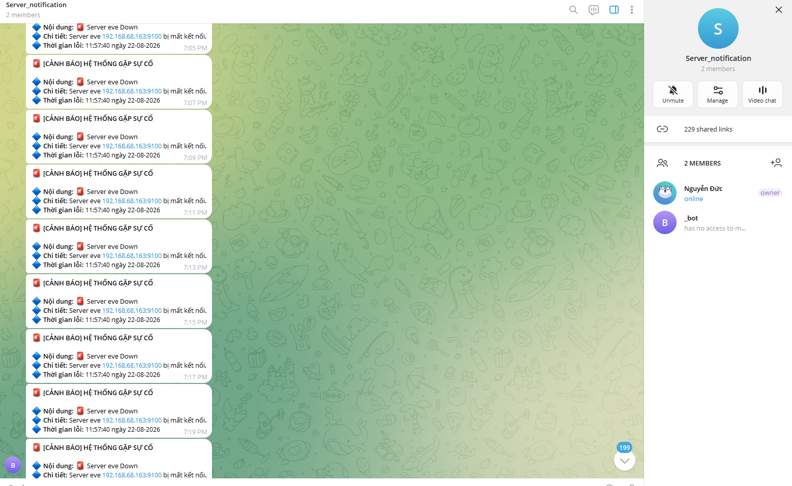

### 3.2 Tích hợp và Cấu hình Mạng Wazuh Indexer
Theo thiết kế mặc định vì lý do bảo mật, Wazuh Indexer chỉ chấp nhận kết nối cục bộ (Loopback `127.0.0.1`). Để Grafana có thể truy xuất dữ liệu từ bên ngoài, cấu hình mạng cần được can thiệp sâu:
1. **Chỉnh sửa cấu hình lõi:** Mở tệp `/etc/wazuh-indexer/opensearch.yml` và thay đổi tham số bind IP `network.host` thành `0.0.0.0`. Lệnh can thiệp:
   ```bash
   sudo sed -i 's/network.host: "127.0.0.1"/network.host: "0.0.0.0"/' /etc/wazuh-indexer/opensearch.yml
   ```
2. **Khởi tạo lại cấu trúc bảo mật:** Việc đổi IP sẽ phá vỡ xác thực nội bộ của Cluster. Quản trị viên tiến hành chạy tập lệnh `indexer-security-init.sh` kèm theo chứng thư số (`admin.pem`) để nạp lại cấu hình bảo mật mới vào bộ nhớ mà không làm gián đoạn dịch vụ:
   ```bash
   sudo /usr/share/wazuh-indexer/bin/indexer-security-init.sh
   ```


### 3.3 Cài đặt Cảm biến An ninh (Wazuh Agent)
Cảm biến an ninh được triển khai đồng loạt trên các máy chủ mục tiêu thông qua gói cài đặt `.deb`.
- Trong quá trình cài đặt, biến môi trường `WAZUH_MANAGER` được khai báo trỏ trực tiếp về địa chỉ IP của máy chủ xử lý trung tâm (Wazuh Server). Lệnh cài đặt tự động hóa:
  ```bash
  wget -q https://packages.wazuh.com/4.x/apt/pool/main/w/wazuh-agent/wazuh-agent_4.12.0-1_amd64.deb -O /tmp/wazuh-agent.deb
  sudo WAZUH_MANAGER='192.168.68.170' WAZUH_AGENT_NAME='xyops' dpkg -i /tmp/wazuh-agent.deb
  ```
- Sau khi kích hoạt dịch vụ, trạng thái kết nối được xác thực bằng công cụ quản lý nội bộ của hệ thống:
  ```bash
  sudo /var/ossec/bin/agent_control -l
  ```


### 3.4 Cấu hình Nguồn Dữ liệu (Data Source) trên Grafana
Để Grafana có thể đọc hiểu định dạng của Wazuh Indexer (OpenSearch), cần thực hiện hai bước tích hợp:
- **Cài đặt Plugin:** Triển khai gói mở rộng `grafana-opensearch-datasource` trực tiếp vào vùng chứa (Container) của Grafana thông qua công cụ `grafana-cli`:
  ```bash
  sudo docker exec grafana grafana cli plugins install grafana-opensearch-datasource
  ```
- **Thiết lập kết nối:** Khai báo Endpoint API tới cổng `9200`. Chế độ định tuyến được thiết lập là **Proxy** nhằm tránh lỗi chính sách nguồn gốc chéo (CORS). Thông số xác thực sử dụng tài khoản `admin` nội bộ, kèm theo thiết lập bỏ qua kiểm duyệt chứng thư số tự ký (TLS Skip Verify). Dữ liệu được trỏ đích xác vào Index Pattern `wazuh-alerts-*`.


### 3.5 Xây dựng Bảng điều khiển (Dashboards)
Sau khi hội tụ thành công các nguồn dữ liệu, các bảng điều khiển (Dashboard) được thiết kế để cung cấp bức tranh toàn cảnh về hệ thống.
- Biểu đồ Metrics phản ánh mức độ tiêu thụ tài nguyên phần cứng (CPU, RAM, Disk I/O) theo thời gian thực.
- Bảng Log an ninh thống kê chi tiết các sự kiện tấn công bị Wazuh ngăn chặn, phân loại theo mức độ nghiêm trọng (Level) và Rule ID.

### 3.6 Thiết lập Cơ chế Cảnh báo (Alerting) trên hệ sinh thái Wazuh
Quy trình tinh chỉnh và kích hoạt các luồng cảnh báo an ninh được thao tác trực tiếp trên giao diện quản trị. Chuỗi thao tác thực tế được minh họa chi tiết dưới đây:

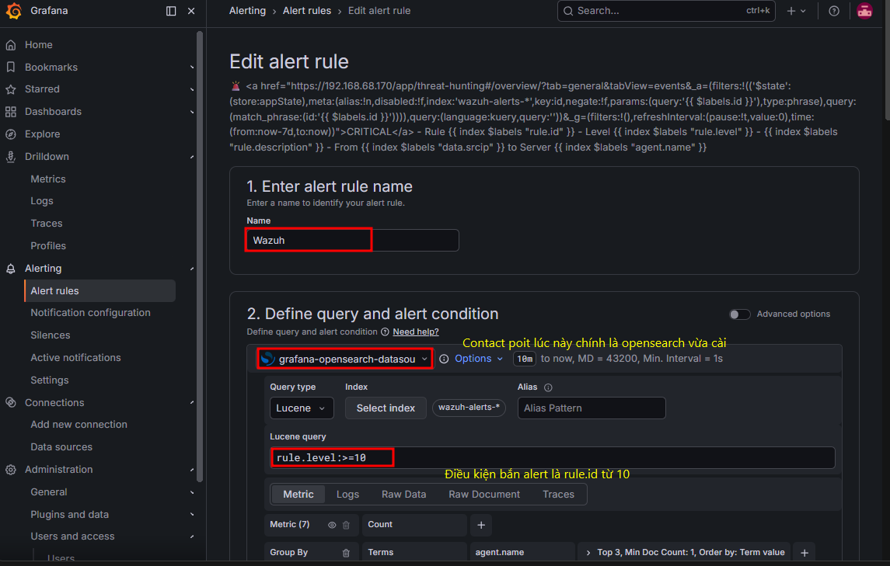

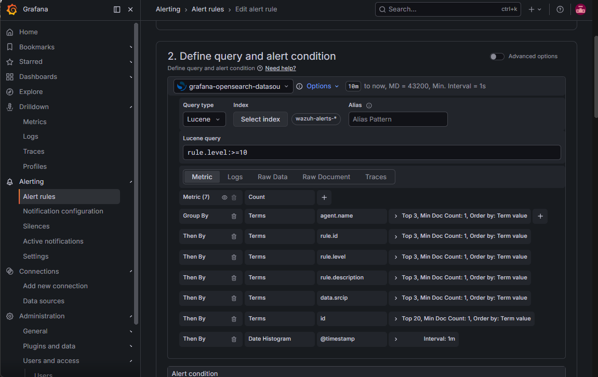

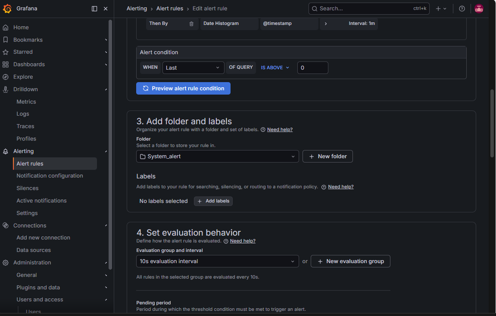

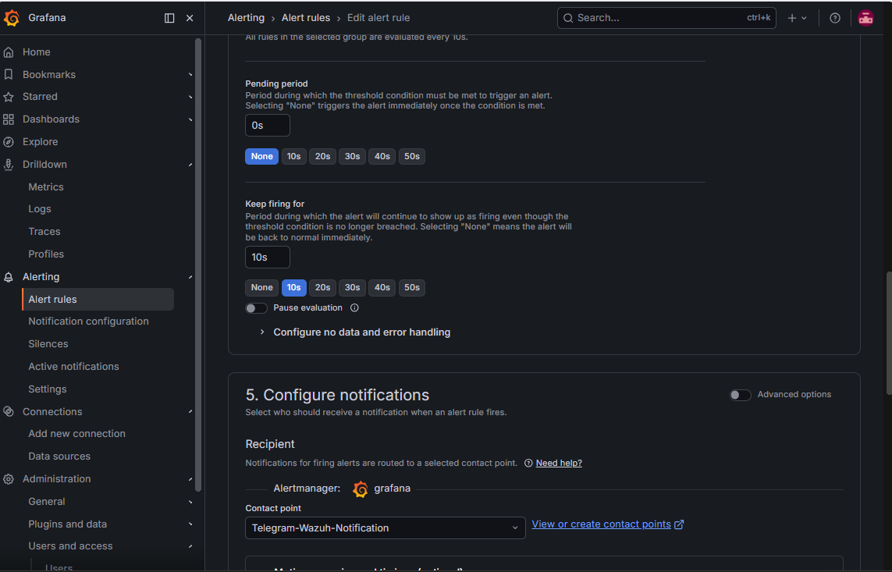

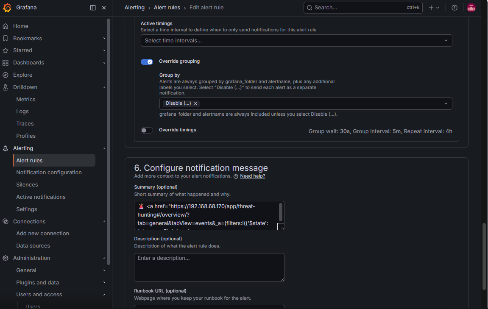

### 3.7 Triển khai Zabbix và Giám sát Thiết bị Mạng (EVE-NG Lab)

Để hoàn thiện hệ thống giám sát tập trung cho toàn bộ hạ tầng (Server, Security, Network), hệ thống tích hợp thêm phân hệ giám sát mạng chuyên dụng **Zabbix** thông qua cơ chế không agent (SNMPv2).

1. **Triển khai Zabbix Container Stack:**
   Zabbix Server, Zabbix Web (Nginx) và cơ sở dữ liệu MySQL được đóng gói gộp chung vào file `docker-compose.yml` tại máy chủ trung tâm `/opt/monitoring`:
   ```yaml
   mysql-server:
     image: mysql:8.0
     container_name: zabbix-mysql
     environment:
       - MYSQL_ROOT_PASSWORD=zabbix_root_pass
       - MYSQL_USER=zabbix
       - MYSQL_PASSWORD=zabbix_pass
       - MYSQL_DATABASE=zabbix

   zabbix-server:
     image: zabbix/zabbix-server-mysql:latest
     container_name: zabbix-server
     environment:
       - DB_SERVER_HOST=mysql-server
       - MYSQL_USER=zabbix
       - MYSQL_PASSWORD=zabbix_pass

   zabbix-web:
     image: zabbix/zabbix-web-nginx-mysql:latest
     container_name: zabbix-web
     ports:
       - "8080:8080"
     environment:
       - DB_SERVER_HOST=mysql-server
       - MYSQL_USER=zabbix
       - MYSQL_PASSWORD=zabbix_pass
       - ZBX_SERVER_HOST=zabbix-server
   ```

2. **Cấu hình SNMP trên các Thiết bị Mạng (EVE-NG Lab):**
   - **Hệ thống pfSense (Firewall & Gateways):**
     - **pfSense Firewall (`192.168.68.176`), pfSense Gateway 1 (`192.168.68.173`) & pfSense Gateway 2 (`192.168.68.182`):** Bật dịch vụ SNMP Daemon trên Web GUI (Services ➔ SNMP ➔ Community: `public`). Cấu hình Rule Firewall WAN cho phép cổng UDP 161 (SNMP) đi qua.
   - **Hệ thống Core Switch Cisco:**
     - **Core Switch Cisco (`192.168.68.180`):** Cấu hình IP Out-of-band Management trên cổng `Gi0/2` cắm ra Cloud Net và bật SNMP Community:
       ```text
       Switch> enable
       Switch# configure terminal
       Switch(config)# interface GigabitEthernet 0/2
       Switch(config-if)# no switchport
       Switch(config-if)# ip address 192.168.68.180 255.255.255.0
       Switch(config-if)# no shutdown
       Switch(config)# snmp-server community public RO
       Switch(config)# end
       Switch# write memory
       ```


3. **Tích hợp Zabbix vào Grafana:**
   Cài đặt plugin `alexanderzobnin-zabbix-app` vào Grafana và cấu hình Data Source trỏ API về `http://192.168.68.181:8080/api_jsonrpc.php` (Xác thực user `Admin`/`zabbix`).

4. **Tự động hóa Cảnh báo qua Telegram Webhook:**
   - Sử dụng tính năng Telegram Webhook có sẵn của Zabbix (`Alerts` ➔ `Media types` ➔ `Telegram`).
   - Cấu hình `api_token` và `api_parse_mode=html`.
   - Gán Telegram Media cho tài khoản Admin với `Send to` là **Chat ID Nhóm Telegram** (`-5477737347`).
   - Tối ưu chu kỳ quét `Update interval = 5s` và sửa biểu thức Trigger sang `last()` để phát hiện sự cố rớt mạng (`Link down`) và gửi tin nhắn cảnh báo đỏ `[PROBLEM]` / xanh `[RESOLVED]` siêu tốc chỉ sau **5 đến 10 giây**.

---

## CHƯƠNG 4: TÍCH HỢP ĐIỀU TRA SỰ CỐ 
Một trong những điểm nhấn kỹ thuật quan trọng nhất của hệ thống là khả năng liên kết sâu (Deep Linking) giữa giao diện cảnh báo (Telegram) và giao diện truy vết (Wazuh Threat Hunting), giúp thu hẹp tối đa thời gian phản ứng sự cố (MTTR - Mean Time To Respond).

### 4.1 Cơ chế trích xuất dữ liệu tự động (Data Extraction)
Khi Wazuh phát hiện sự cố, hệ thống không chỉ phát cảnh báo chung chung mà còn đóng gói toàn bộ ngữ cảnh tấn công (IP nguồn, tài khoản bị xâm phạm, mã lỗi) thành một tài liệu JSON. 
Khi Grafana truy vấn Wazuh Indexer thông qua giao thức REST API, hệ thống Grafana Alerting sẽ tự động phân tích (parse) cấu trúc JSON này và trích xuất các giá trị quan trọng thành các Nhãn động (Dynamic Labels). Ví dụ điển hình: IP thực của kẻ tấn công sẽ được hệ thống bóc tách và gán vào biến số `{{ index .Labels "data.srcip" }}`.

### 4.2 Kỹ thuật nhúng mã và Định tuyến (URL Embedding & Routing)
Để biến tin nhắn Telegram từ một đoạn văn bản thuần túy thành một công cụ điều tra tương tác, đồ án đã tiến hành can thiệp vào cấu trúc khuôn mẫu (Message Template) của Grafana thông qua ngôn ngữ Go Template. 
Cụ thể, một đường link định tuyến URL được sinh tự động và nhúng trực tiếp vào nút bấm **"CRITICAL"**. Đường link này tuân thủ cấu trúc mã hóa RISON của OpenSearch Dashboards, cho phép truyền thẳng câu lệnh truy vấn (KQL - Kuery) vào thanh tìm kiếm của trình duyệt:
`https://<WAZUH_IP>/app/discover#/?_a=(query:(language:kuery,query:'data.srcip:"{{ index .Labels "data.srcip" }}"'))`

### 4.3 Quy trình phản ứng sự cố thực tế (Automated Incident Response Flow)
Nhờ sự kết hợp của hai kỹ thuật trên, luồng vận hành SOC thực tế được tối ưu hóa ở mức cao nhất:
1. Grafana phát hiện cuộc tấn công (Ví dụ: SSH Brute-force) và bắn tin nhắn cảnh báo tới nhóm điều hành trên Telegram.
2. Quản trị viên (SOC Analyst) nhấn vào nút **"CRITICAL"** đính kèm phía dưới tin nhắn.
3. Trình duyệt lập tức chuyển hướng và đăng nhập thẳng vào giao diện OpenSearch Dashboards của Wazuh SIEM.
4. Dựa vào bộ mã RISON, thanh tìm kiếm KQL của Wazuh tự động điền sẵn bộ lọc truy vấn bằng chính IP của kẻ tấn công (Ví dụ: `data.srcip: "192.168.68.181"`).
5. Quản trị viên ngay lập tức quan sát được toàn bộ chuỗi hành vi của tác nhân độc hại trên một màn hình duy nhất, lược bỏ hoàn toàn các bước tra cứu và trích xuất log thủ công tốn thời gian.

---

## CHƯƠNG 5: KẾT LUẬN VÀ HƯỚNG PHÁT TRIỂN

### 5.1 Kết quả đạt được
Đồ án đã triển khai thành công kiến trúc giám sát và cảnh báo an toàn thông tin tập trung, đáp ứng các tiêu chuẩn vận hành hệ thống cấp độ doanh nghiệp (Enterprise). Những đóng góp chính của đề tài bao gồm:
- **Tối ưu hóa quy trình vận hành:** Khắc phục triệt để tình trạng phân mảnh công cụ giám sát bằng việc thiết lập thành công mô hình giám sát tập trung trên nền tảng Grafana kết hợp 3 trụ cột dữ liệu (Prometheus, Wazuh SIEM, Zabbix).
- **Quy hoạch luồng dữ liệu thông minh:** Phân tách và xử lý hiệu quả 3 luồng dữ liệu đặc thù là Metrics hệ thống (Prometheus), Security Logs (Wazuh), và Network Traffic (Zabbix SNMP).
- **Mở rộng năng lực giám sát hạ tầng mạng:** Tích hợp thành công Zabbix Server thu thập băng thông và trạng thái kết nối của các thiết bị mạng cốt lõi (Firewall pfSense, Core Switch Cisco) trong môi trường Lab EVE-NG.
- **Nâng cao năng lực phản ứng sự cố (Incident Response):** Triển khai thành công kỹ thuật liên kết sâu (Deep Linking) thông qua mã hóa RISON và cơ chế Webhook Telegram siêu tốc (5-10s), giúp tự động hóa quy trình truy vết tác nhân đe dọa trực tiếp từ nền tảng Telegram.


### 5.2 Hướng phát triển mở rộng: Định hình Kiến trúc AIOps
Dựa trên nền tảng dữ liệu đã hội tụ, lộ trình phát triển tiếp theo của hệ thống hướng tới mô hình Trí tuệ nhân tạo trong Vận hành CNTT (AIOps), cụ thể bao gồm các hạng mục:
1. **Ngữ cảnh hóa tự động (Automated Contextualization):** Tích hợp tính năng tự động trích xuất và đính kèm biểu đồ tài nguyên hệ thống (CPU, RAM) tại thời điểm phát sinh sự cố vào thông báo cảnh báo.
2. **Thu thập trạng thái thời gian thực (State Snapshotting):** Xây dựng cơ chế kích hoạt tự động (Auto-trigger) để thực thi các lệnh chẩn đoán (ví dụ: `top`, `netstat`) ngay khi nhận diện rủi ro, nhằm thu thập bằng chứng kỹ thuật (forensics) tức thời.
3. **Tích hợp Mô hình Ngôn ngữ Lớn (LLMs):** Thiết lập cơ chế Webhook định tuyến cảnh báo từ Grafana tới các Tác tử AI (AI Agents). Tác tử AI đảm nhiệm phân tích tương quan đa chiều, suy luận nguyên nhân gốc rễ (Root Cause Analysis) và đề xuất Kế hoạch khắc phục tự động (Auto-remediation Plan).
4. **Kiến tạo hệ sinh thái Vòng lặp kín (Closed-loop System):** Hoàn thiện quy trình tự động hóa toàn trình: Nhận diện sự cố nhanh chóng (Grafana) ➔ Phân tích ngữ cảnh thông minh (AI) ➔ Phê duyệt và Thực thi khắc phục an toàn.

---

## TÀI LIỆU THAM KHẢO

1. **Wazuh Documentation.** (2024). *Wazuh SIEM and XDR Comprehensive Documentation*. Truy cập từ: https://documentation.wazuh.com/
2. **Prometheus Authors.** (2024). *Prometheus - Monitoring system & time series database*. Truy cập từ: https://prometheus.io/docs/
3. **Grafana Labs.** (2024). *Grafana Documentation - Data visualization and Alerting*. Truy cập từ: https://grafana.com/docs/
4. **OpenSearch Contributors.** (2024). *OpenSearch Documentation - Distributed Search and Analytics Engine*. Truy cập từ: https://opensearch.org/docs/latest/
5. **MITRE Corporation.** (2024). *MITRE ATT&CK Framework - Enterprise Matrix*. Truy cập từ: https://attack.mitre.org/
6. **Samber.** (2024). *Awesome Prometheus Alerts*. Truy cập từ: https://samber.github.io/awesome-prometheus-alerts/
